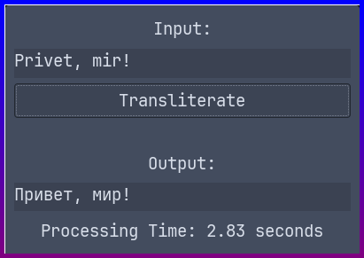

# Transliteratron

This is a Python GTK3 application that transliterates text using a remote LLM API. This was created merely for educational purposes and can be unreliable.

## Features

- Transliterates text.
- Simple and intuitive GUI using GTK3.

## Prerequisites

- Linux system.
- GTK3 toolkit installed on your system.
- Access to an LLM API - for local LLMs feel free to make a PR to add support.

## Usage

```sh
git clone https://github.com/DatCodeMania/Transliteratron.git
cd Transliteratron
python3 -m venv venv
source venv/bin/activate
pip install -r requirements.txt
python3 main.py
```

## Example


Transliteratron does not include colored borders, that is from [LinuxSSTool](https://github.com/DatCodeMania/LinuxSSTool)